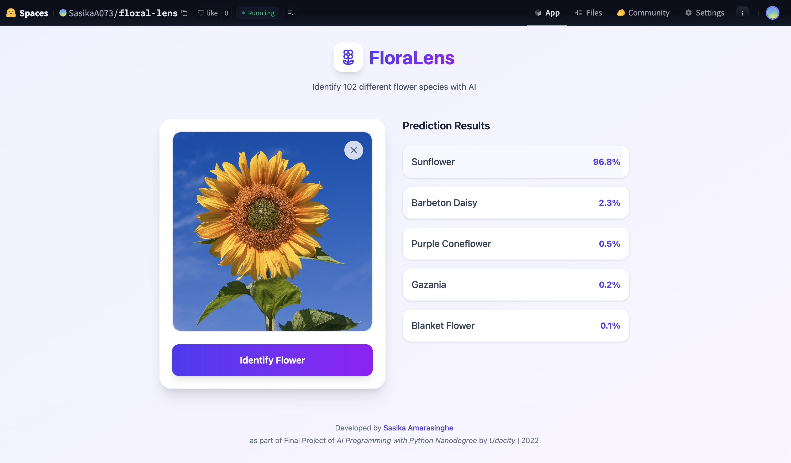

# Floral Lens : Flower Images Classifier 

Project code for Udacity's AI Programming with Python Nanodegree program. In this project, students first develop code for an image classifier built with PyTorch, then convert it into a command line application.

🤗 HF Spaces Demo : https://huggingface.co/spaces/SasikaA073/floral-lens