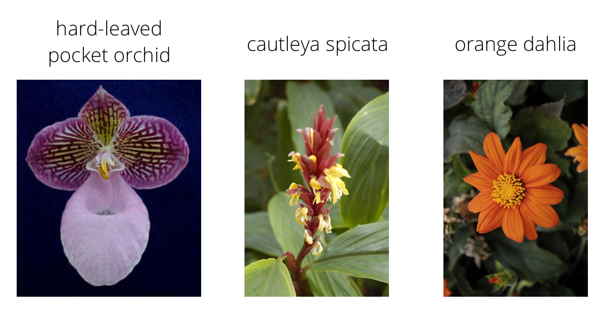
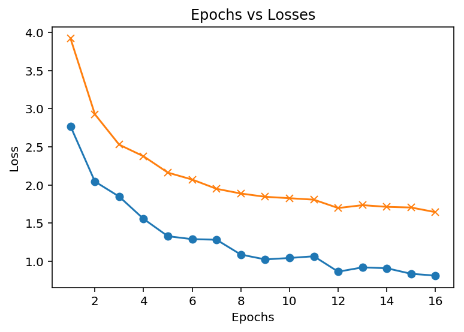
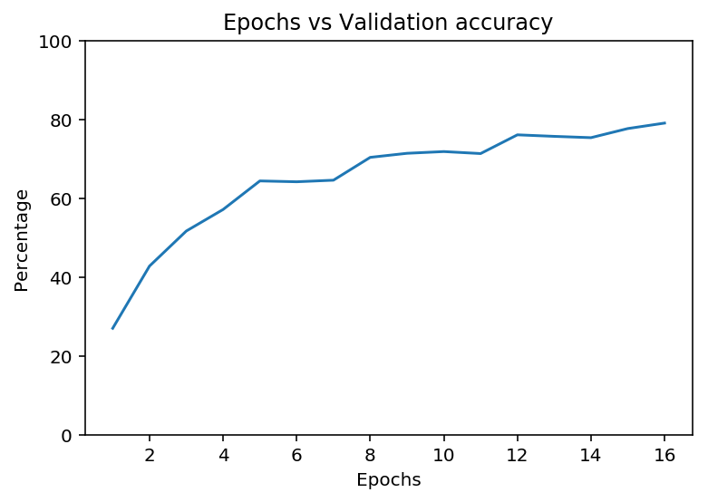
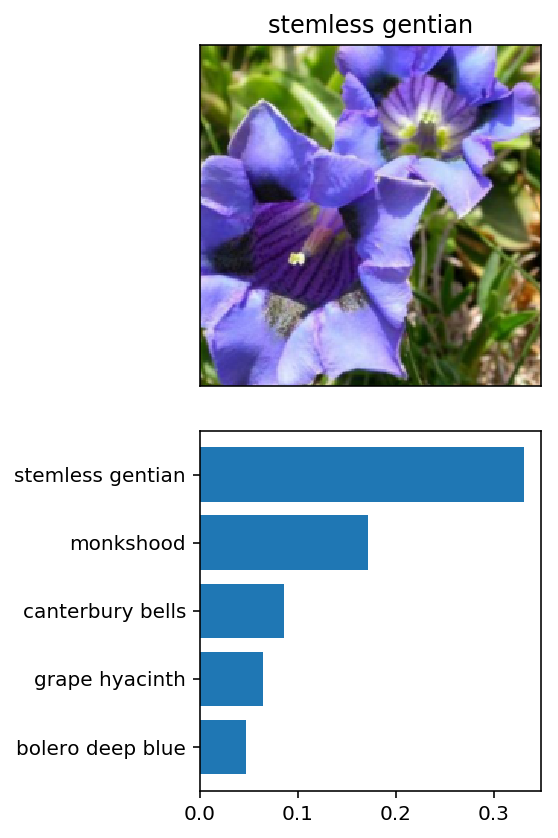
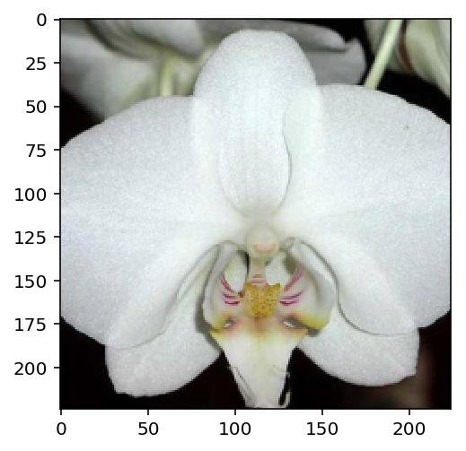
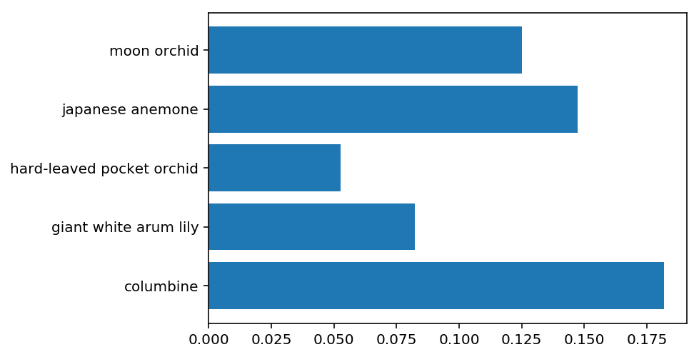

# 🌸 Flower Images Classifier

---
>This is my final project in the AI programming with Python Nanodegree program by Udacity. 
This project consists of two parts.
1. Jupyter Notebook part
2. Command line application to predict the class of a flower once the image is given.

---

In this project, I have trained an image classifier to recognize different species of flowers.  I used [this dataset](http://www.robots.ox.ac.uk/~vgg/data/flowers/102/index.html) of 102 flower categories. These are some examples. 



The project is broken down into multiple steps:

* Load and preprocess the image dataset
* Train the image classifier on your dataset
* Use the trained classifier to predict image content

```python
# Imports packages
import torch
from torch import nn, optim
import torch.nn.functional as F
from torchvision import datasets, transforms, models

import numpy as np
import pandas as pd

import seaborn as sb 
import matplotlib.pyplot as plt

from PIL import Image

import time,json

%matplotlib inline
%config InlineBackend.figure_format = 'retina'
```

## Load the data

The dataset is split into three parts, training, validation, and testing. For the training, it is required to use transformations such as random scaling, cropping, and flipping. This will help the network generalize leading to better performance. Make sure data is resized to 224x224 pixels as required by the pre-trained networks.

The validation and testing sets are used to measure the model's performance on data it hasn't seen yet. 

The pre-trained networks you'll use were trained on the ImageNet dataset where each color channel was normalized separately. For all three sets you'll need to normalize the means and standard deviations of the images to what the network expects. For the means, it's `[0.485, 0.456, 0.406]` and for the standard deviations `[0.229, 0.224, 0.225]`, calculated from the ImageNet images.  These values will shift each color channel to be centered at 0 and range from -1 to 1.

```python
data_dir = 'flowers'
train_dir = data_dir + '/train'
valid_dir = data_dir + '/valid'
test_dir = data_dir + '/test'

# Define your transforms for the training, validation, and testing sets
train_transforms = transforms.Compose([transforms.RandomRotation(30),
                                       transforms.RandomResizedCrop(224),
                                       transforms.RandomHorizontalFlip(),
                                       transforms.RandomVerticalFlip(),
                                       transforms.ToTensor(),
                                       transforms.Normalize([0.485, 0.456, 0.406],
                                                            [0.229, 0.224, 0.225])])

test_valid_transforms = transforms.Compose([transforms.Resize(255),
                                            transforms.CenterCrop(224),
                                            transforms.ToTensor(),
                                            transforms.Normalize([0.485, 0.456, 0.406],
                                                                 [0.229, 0.224, 0.225])])
# Load the datasets with ImageFolder
train_data = datasets.ImageFolder(train_dir, transform=train_transforms)
valid_data = datasets.ImageFolder(valid_dir, transform=test_valid_transforms)
test_data = datasets.ImageFolder(test_dir, transform=test_valid_transforms)

# Using the image datasets and the trainforms, define the dataloaders
train_loader = torch.utils.data.DataLoader(
    train_data, batch_size=32, shuffle=True)
valid_loader = torch.utils.data.DataLoader(
    valid_data, batch_size=32, shuffle=True)
test_loader = torch.utils.data.DataLoader(test_data, batch_size=32)

```

## Label mapping

Loads a json file, and convert it into a dictionary mapping the integer encoded categories to the actual names of the flowers.

```python
with open('cat_to_name.json', 'r') as f:
    cat_to_name = json.load(f)


output_layer_size = len(cat_to_name)

```


## Building and training the classifier

```python
# Build and train your network
model = models.densenet201(pretrained=True)

# To view the model architecture
model 
```

```cmd
    Downloading: "https://download.pytorch.org/models/densenet201-c1103571.pth" to /root/.torch/models/densenet201-c1103571.pth
    100%|██████████| 81131730/81131730 [00:01<00:00, 64976186.49it/s]
```
    DenseNet(
      (features): Sequential(
        (conv0): Conv2d(3, 64, kernel_size=(7, 7), stride=(2, 2), padding=(3, 3), bias=False)
        (norm0): BatchNorm2d(64, eps=1e-05, momentum=0.1, affine=True, track_running_stats=True)
        (relu0): ReLU(inplace)
        (pool0): MaxPool2d(kernel_size=3, stride=2, padding=1, dilation=1, ceil_mode=False)
        (denseblock1): _DenseBlock(
          (denselayer1): _DenseLayer(
            (norm1): BatchNorm2d(64, eps=1e-05, momentum=0.1, affine=True, track_running_stats=True)
            (relu1): ReLU(inplace)
            (conv1): Conv2d(64, 128, kernel_size=(1, 1), stride=(1, 1), bias=False)
            (norm2): BatchNorm2d(128, eps=1e-05, momentum=0.1, affine=True, track_running_stats=True)
            (relu2): ReLU(inplace)
            (conv2): Conv2d(128, 32, kernel_size=(3, 3), stride=(1, 1), padding=(1, 1), bias=False)
          )
          ...
          ...
          ...
          (denselayer30): _DenseLayer(
            (norm1): BatchNorm2d(1824, eps=1e-05, momentum=0.1, affine=True, track_running_stats=True)
            (relu1): ReLU(inplace)
            (conv1): Conv2d(1824, 128, kernel_size=(1, 1), stride=(1, 1), bias=False)
            (norm2): BatchNorm2d(128, eps=1e-05, momentum=0.1, affine=True, track_running_stats=True)
            (relu2): ReLU(inplace)
            (conv2): Conv2d(128, 32, kernel_size=(3, 3), stride=(1, 1), padding=(1, 1), bias=False)
          )
          (denselayer31): _DenseLayer(
            (norm1): BatchNorm2d(1856, eps=1e-05, momentum=0.1, affine=True, track_running_stats=True)
            (relu1): ReLU(inplace)
            (conv1): Conv2d(1856, 128, kernel_size=(1, 1), stride=(1, 1), bias=False)
            (norm2): BatchNorm2d(128, eps=1e-05, momentum=0.1, affine=True, track_running_stats=True)
            (relu2): ReLU(inplace)
            (conv2): Conv2d(128, 32, kernel_size=(3, 3), stride=(1, 1), padding=(1, 1), bias=False)
          )
          (denselayer32): _DenseLayer(
            (norm1): BatchNorm2d(1888, eps=1e-05, momentum=0.1, affine=True, track_running_stats=True)
            (relu1): ReLU(inplace)
            (conv1): Conv2d(1888, 128, kernel_size=(1, 1), stride=(1, 1), bias=False)
            (norm2): BatchNorm2d(128, eps=1e-05, momentum=0.1, affine=True, track_running_stats=True)
            (relu2): ReLU(inplace)
            (conv2): Conv2d(128, 32, kernel_size=(3, 3), stride=(1, 1), padding=(1, 1), bias=False)
          )
        )
        (norm5): BatchNorm2d(1920, eps=1e-05, momentum=0.1, affine=True, track_running_stats=True)
      )
      (classifier): Linear(in_features=1920, out_features=1000, bias=True)
    )


```python
input_layer_size = model.classifier.in_features
output_layer_size = len(cat_to_name)
```


```python
class FlowerClassifier(nn.Module):

    """
    Fully connected / Dense network to be used in the transfered model
    """

    def __init__(self, input_size, output_size, hidden_layers, dropout_p=0.3):
        """
        Parameters
        ----------
            
            input_size : no of units in the input layer (usually the pretrained classifier's 
            features_in value)

            output_size : no of units (no of classes that we have to classify the dataset)

            hidden_layers : a list with no of units in each hidden layer

            dropout_p : dropout probability (to avoid overfitting)        

        """

        super().__init__()

        self.hidden_layers = nn.ModuleList(
            [nn.Linear(input_size, hidden_layers[0])])

        layer_sizes = zip(hidden_layers[:-1], hidden_layers[1:])
        self.hidden_layers.extend([nn.Linear(h1, h2)
                                  for h1, h2 in layer_sizes])
        
        self.output = nn.Linear(hidden_layers[-1], output_size)

        # add a dropout propability to avoid overfitting
        self.dropout = nn.Dropout(p=dropout_p)

    def forward(self, x):

        for each in self.hidden_layers:
            x = self.dropout(F.relu(each(x)))

        x = self.output(x)
        x = F.log_softmax(x, dim=1)

        return x

```


```python
# Use GPU for computaion if it's available
device = torch.device("cuda" if torch.cuda.is_available() else "cpu");
```


```python
# funtion to train the model
def train(model, epochs, criterion, optimizer, train_loader=train_loader, valid_loader=valid_loader, manual_seed=42):
    """
        Train the given model.


        Parameters
        ----------
        model : model for the classification problem
        
        epochs : no of complete iterations over the entire dataset
        
        criterion : loss function / cost function to see how much our model has been deviated from the real values
                examples :: Categorical Cross-Entropy Loss , Negative Log-Likelihood Loss
        
        optimizer : The algorithm that is used to update the parameters of the model
                examples :: Stochastic Gradient Descent (SGD) , Adam algorithm
        
        train_loader : loader for the training dataset
        
        valid_loader : loader fot the validation dataset
         

        Returns
        -------
        performance_list : a list with details of the model during each epoch

    """

    performance_list = []

    torch.manual_seed(manual_seed)
    
    start = time.time()
    
    with active_session():
        
        for e in range(1,epochs+1):
    
            train_total_loss = 0
            valid_total_loss = 0
        
            for images, labels in train_loader:
        
                # move images and labels data from GPU to CPU, back and forth.                    
                images = images.to(device)
                labels = labels.to(device)
            
                log_ps = model(images)
                loss = criterion(log_ps, labels)
                train_total_loss += loss.item()
        
                # To avoid accumulating gradients
                optimizer.zero_grad()

                # Back propagation
                loss.backward()
                optimizer.step()
            
            model.eval()

            accuracy = 0

            with torch.no_grad():
                for images, labels in valid_loader:
        
                    images = images.to(device)
                    labels = labels.to(device)
        
        
                    log_ps = model.forward(images)
                    loss = criterion(log_ps, labels)
                    valid_total_loss += loss.item()
        
                    top_p, top_class = log_ps.topk(1)
                    equals = top_class == labels.view(*top_class.shape)
                    accuracy += 100 * torch.mean(equals.type(torch.FloatTensor)).item()
            
                accuracy = accuracy / len(valid_loader)
                train_loss = train_total_loss / len(train_loader)
                valid_loss = valid_total_loss / len(valid_loader) 
        
                performance_list.append((e , train_loss, valid_loss, accuracy, model.state_dict()))
        
                end = time.time()
                epoch_duration = end - start
                print(f"Epoch: {e}, Train loss: {train_loss:.3f}, Valid loss: {valid_loss:.3f}, Accuracy: {accuracy:.3f}%, time duration per epoch: {epoch_duration:.3f}s")
            
            model.train()
    
    return performance_list
    
# function to test the model performance
def validation(model, criterion, test_loader, device):
    
    """"
    Test the performance of the model on a test dataset

    Parameters
    ----------
        model : model for the classification problem
        
        criterion : loss function / cost function to see how much our model has been deviated from the real values
            examples :: Categorical Cross-Entropy Loss , Negative Log-Likelihood Loss

        test_loader : loader fot the test dataset

        device : use `gpu` or `cpu` for computation
        
    Returns
    ----------
        a tuple with the accuracy and test_loss on the given dataset
        

    """
    
    model.eval()
    model.to(device)
    accuracy = 0
       
    with torch.no_grad():
        test_loss = 0
        for images, labels in test_loader:
    
            images = images.to(device)
            labels = labels.to(device)
                
            log_ps = model.forward(images)
                
            test_loss += criterion(log_ps, labels).item()
                
            top_p, top_class = log_ps.topk(1, dim=1)
            equals = top_class == labels.view(*top_class.shape)
            accuracy += 100 * (torch.mean(equals.type(torch.FloatTensor)).item())
    
        test_loss = test_loss / len(valid_loader)
        accuracy = accuracy / len(valid_loader)


        print(f"Accuracy: {accuracy:.3f}%\nTest loss: {test_loss:.3f}")
        return (accuracy, test_loss)
```


```python
model = models.densenet201(pretrained=True)

# Freeze parameters so we don't backprop through them
for param in model.parameters():
    param.requires_grad = False
    
hidden_layer_units = [1024, 512, 256]
my_classifier = FlowerClassifier(input_layer_size, output_layer_size, hidden_layer_units, dropout_p=0.2)
model.classifier = my_classifier

model.to(device)

optimizer = optim.Adam(model.classifier.parameters(), lr=0.003)
criterion = nn.NLLLoss()

model_list = train(model=model, epochs=16, optimizer=optimizer, criterion=criterion)

```
```cmd
    Epoch: 1, Train loss: 3.917, Valid loss: 2.767, Accuracy: 26.976%, time duration per epoch: 194.214s
    Epoch: 2, Train loss: 2.926, Valid loss: 2.045, Accuracy: 42.762%, time duration per epoch: 376.733s
    Epoch: 3, Train loss: 2.527, Valid loss: 1.847, Accuracy: 51.656%, time duration per epoch: 559.668s
    Epoch: 4, Train loss: 2.376, Valid loss: 1.555, Accuracy: 57.118%, time duration per epoch: 742.296s
    Epoch: 5, Train loss: 2.161, Valid loss: 1.328, Accuracy: 64.370%, time duration per epoch: 924.386s
    Epoch: 6, Train loss: 2.070, Valid loss: 1.289, Accuracy: 64.156%, time duration per epoch: 1106.762s
    Epoch: 7, Train loss: 1.949, Valid loss: 1.282, Accuracy: 64.557%, time duration per epoch: 1289.242s
    Epoch: 8, Train loss: 1.887, Valid loss: 1.087, Accuracy: 70.353%, time duration per epoch: 1471.411s
    Epoch: 9, Train loss: 1.845, Valid loss: 1.024, Accuracy: 71.381%, time duration per epoch: 1653.647s
    Epoch: 10, Train loss: 1.826, Valid loss: 1.042, Accuracy: 71.822%, time duration per epoch: 1835.788s
    Epoch: 11, Train loss: 1.807, Valid loss: 1.065, Accuracy: 71.314%, time duration per epoch: 2017.690s
    Epoch: 12, Train loss: 1.697, Valid loss: 0.863, Accuracy: 76.068%, time duration per epoch: 2199.950s
    Epoch: 13, Train loss: 1.735, Valid loss: 0.919, Accuracy: 75.681%, time duration per epoch: 2381.585s
    Epoch: 14, Train loss: 1.713, Valid loss: 0.908, Accuracy: 75.347%, time duration per epoch: 2563.224s
    Epoch: 15, Train loss: 1.704, Valid loss: 0.835, Accuracy: 77.658%, time duration per epoch: 2745.755s
    Epoch: 16, Train loss: 1.643, Valid loss: 0.812, Accuracy: 79.046%, time duration per epoch: 2927.450s

```
```python
# dataframe to store performance of the model, so that we can change the hyperparameters
model_performance_architecture_df = pd.DataFrame(model_list)
model_performance_architecture_df.rename(
    columns={
        0: 'epoch',
        1: 'train_loss',
        2: 'valid_loss',
        3: 'valid_accuracy',
        4: 'state_dict'
    },inplace=True)

model_performance_df = model_performance_architecture_df.iloc[:, :4]
```

```python
plt.plot(model_performance_df['epoch'], model_performance_df['valid_loss'],'-o',label='validation loss')
plt.plot(model_performance_df['epoch'], model_performance_df['train_loss'], '-x', label='training loss');

plt.xlabel('Epochs')
plt.ylabel('Loss')
plt.title('Epochs vs Losses');
```





```python
plt.plot(model_performance_df['epoch'], model_performance_df['valid_accuracy'])
plt.xlabel('Epochs')
plt.ylabel('Percentage')
plt.title("Epochs vs Validation accuracy")

plt.ylim(0, 100);
```





## Testing the network

The network is tested on the images that the network has never seen either in training or validation. This gives a good estimate for the model's performance on completely new images. 

```python
# Do validation on the test set
validation(model, nn.NLLLoss(), test_loader, 'cuda');
```

    Accuracy: 79.194%
    Test loss: 0.832


## Save the checkpoint

Here after the network is trained, it is saved in oreder to load it later for making predictions. 

Make sure to include any information that is needed in the checkpoint, to rebuild the model for inference.
It is necessary to include pretrained network architecture as well. Otherwise conflicts can be happened.

```Python
# Save the checkpoint 
checkpoint = {'input_size' : input_layer_size,
             'output_size' : output_layer_size,
             'hidden_layers' : [each.out_features for each in model.classifier.hidden_layers],
             'model_data' : pd.DataFrame(model_list),
             'class_to_idx' : test_data.class_to_idx}

torch.save(checkpoint, 'checkpoint.pth')
```

## Loading the checkpoint

At this point it's good to write a function that can load a checkpoint and rebuild the model. That way you can come back to this project and keep working on it without having to retrain the network.


```python
# Write a function that loads a checkpoint and rebuilds the model
def load_checkpoint(filepath, idx, test_data):
    checkpoint = torch.load(filepath)
    
    input_size = checkpoint['input_size']
    output_size = checkpoint['output_size']
    hidden_layers = checkpoint['hidden_layers']
    state_dict = checkpoint['model_data'].iloc[idx, 4]
    class_to_idx = checkpoint['class_to_idx']
    
    model = models.densenet201()
    classifier = FlowerClassifier(input_size, output_size, hidden_layers, dropout_p=0.2)
    model.classifier = classifier
    model.load_state_dict(state_dict)
    model.class_to_idx = class_to_idx
    
    return model
```


```python
imported_model = load_checkpoint('checkpoint.pth', idx=3, test_data=test_data)
```


## Inference for classification

Her an image is parsed into the network and then the class of the flower in the image is predicted.

```python
probs, classes = predict(image_path, model)
print(probs)
print(classes)
> [ 0.01558163  0.01541934  0.01452626  0.01443549  0.01407339]
> ['70', '3', '45', '62', '55']
```

## Image Preprocessing

First, resize the images where the shortest side is 256 pixels, keeping the aspect ratio. This can be done with the [`thumbnail`](http://pillow.readthedocs.io/en/3.1.x/reference/Image.html#PIL.Image.Image.thumbnail) or [`resize`](http://pillow.readthedocs.io/en/3.1.x/reference/Image.html#PIL.Image.Image.thumbnail) methods. Then  the center 224x224 portion of the image., has to be cropped out. you'll need to crop out the center 

Color channels of images are typically encoded as integers 0-255, but the model expected floats 0-1. Now the values are converted using with a Numpy array, which can be returned from a PIL image like so `np_image = np.array(pil_image)`.

As before, the network expects the images to be normalized in a specific way. For the means, it's `[0.485, 0.456, 0.406]` and for the standard deviations `[0.229, 0.224, 0.225]`. Now, subtract the means from each color channel, then divide by the standard deviation. 

And finally, PyTorch expects the color channel to be the first dimension but it's the third dimension in the PIL image and Numpy array. We can reorder dimensions using [`ndarray.transpose`](https://docs.scipy.org/doc/numpy-1.13.0/reference/generated/numpy.ndarray.transpose.html). The color channel needs to be first and retain the order of the other two dimensions.

```python
def process_image(image):
    ''' Scales, crops, and normalizes a PIL image for a PyTorch model,
        returns an Numpy array
    '''

    # Process a PIL image for use in a PyTorch model
    preprocess = transforms.Compose([
        transforms.Resize(256),
        transforms.CenterCrop(224),
        transforms.ToTensor(),
        transforms.Normalize(mean=[0.485, 0.456, 0.406], std=[
            0.229, 0.224, 0.225])
    ])
    return preprocess(image)

```

```python
# function to return the original image
def imshow(image, ax=None, title=None):
    """Imshow for Tensor."""
    if ax is None:
        fig, ax = plt.subplots()
    
    # PyTorch tensors assume the color channel is the first dimension
    # but matplotlib assumes is the third dimension
    image = image.numpy().transpose((1, 2, 0))
    
    # Undo preprocessing
    mean = np.array([0.485, 0.456, 0.406])
    std = np.array([0.229, 0.224, 0.225])
    image = std * image + mean
    
    # Image needs to be clipped between 0 and 1 or it looks like noise when displayed
    image = np.clip(image, 0, 1)
    
    ax.imshow(image)
    return ax
```

## Class Prediction

```python
probs, classes = predict(image_path, model)
print(probs)
print(classes)
> [ 0.01558163  0.01541934  0.01452626  0.01443549  0.01407339]
> ['70', '3', '45', '62', '55']
```

```python
def predict(image_path, model, topk=5):
    ''' Predict the class (or classes) of an image using a trained deep learning model.
    '''
    
    # Implement the code to predict the class from an image file
    with Image.open(image_path) as im:
        image = process_image(im)
    image.unsqueeze_(0)
    model.eval()
    class_to_idx = model.class_to_idx
    idx_to_class = {idx : class_ for class_, idx in model.class_to_idx.items()}
    with torch.no_grad():
        log_ps = model(image)
        ps = torch.exp(log_ps)
        probs, idxs = ps.topk(topk)
    idxs = idxs[0].tolist()
    classes = [idx_to_class[idx] for idx in idxs]
        
    print('Probabilities: {}\nClasses: {}'.format(probs, classes))
    return probs, classes
```

## Sanity Checking

Even if the testing accuracy is high, it's always good to check that there aren't obvious bugs. Use `matplotlib` to plot the probabilities for the top 5 classes as a bar graph, along with the input image. It should look like this:

<!--  -->

The class integer encoding can be converted to actual flower names with the `cat_to_name.json` file (should have been loaded earlier in the notebook). To show a PyTorch tensor as an image, use the `imshow` function defined above.

```python
# Display an image along with the top 5 classes
# show sample photo
sample_img_dir = 'flowers/train/7/image_07203.jpg'
with Image.open(sample_img_dir) as im:
    image = process_image(im)
    imshow(image)    
```





```python
probs, classes = predict(sample_img_dir, imported_model)
```

    Probabilities: tensor([[ 0.1818,  0.1474,  0.1250,  0.0822,  0.0527]])
    Classes: ['84', '62', '7', '20', '2']

```python
names = [cat_to_name[class_] for class_ in classes]
probs = probs.numpy()[0]
```

```python
plt.barh(names, probs);
```



